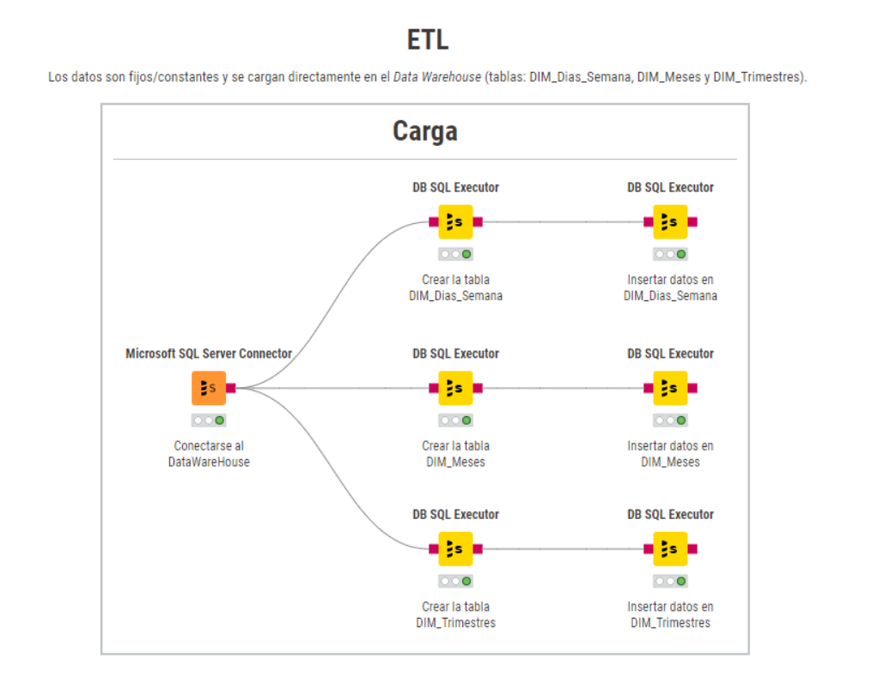

# ETL
Los datos son fijos/constantes y se cargan directamente en el Data Warehouse (tablas: DIM_Dias_Semana, DIM_Meses y DIM_Trimestres).

# Consideraciones:
- Orden de ejecución: 6
- No tienen dependencias, se puede ejecutar en cualquier orden.
- No es necesaria la preexistencia de las tablas, el proceso es capaz de crearlas durante la ejecución.
- Verificar la conexión a la(s) base(s) de dato(s) antes de la ejecución del ETL.
