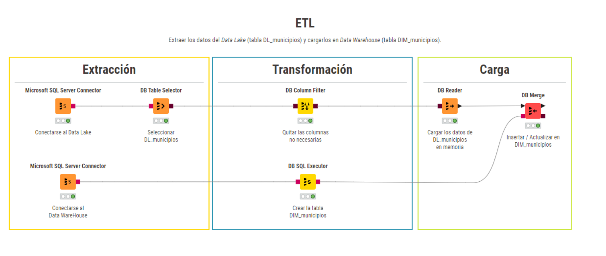

# ETL

Extraer los datos del Data Lake (tabla DL_Municipios) y cargarlos en Data Warehouse (tabla DIM_Municipios).

# Consideraciones:

- Orden de ejecución: 2
- Se debe ejecutar en el orden de las dependencias: primero DIM_Departamentos y luego DIM_Municipios.
- No es necesaria la preexistencia de la tabla, el proceso es capaz de crearla durante la ejecución.
- Verificar la conexión a la(s) base(s) de dato(s) antes de la ejecución del ETL.
