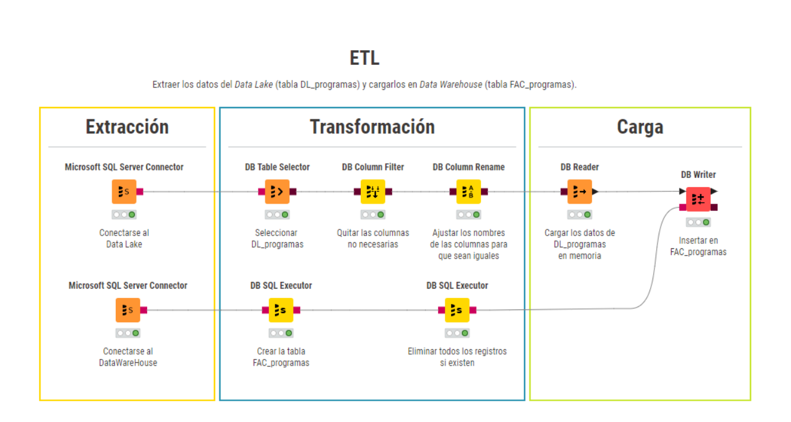

# ETL

Extraer los datos del Data Lake (tabla DL_programas) y cargarlos en Data Warehouse (tabla FAC_programas).

# Consideraciones:

- Orden de ejecución: 8
- Tiene dependencias de todas las tablas dimensionales. Se debe ejecutar después de las dependencias.
- No es necesaria la preexistencia de la tabla, el proceso es capaz de crearla durante la ejecución.
- Verificar la conexión a la(s) base(s) de dato(s) antes de la ejecución del ETL.
