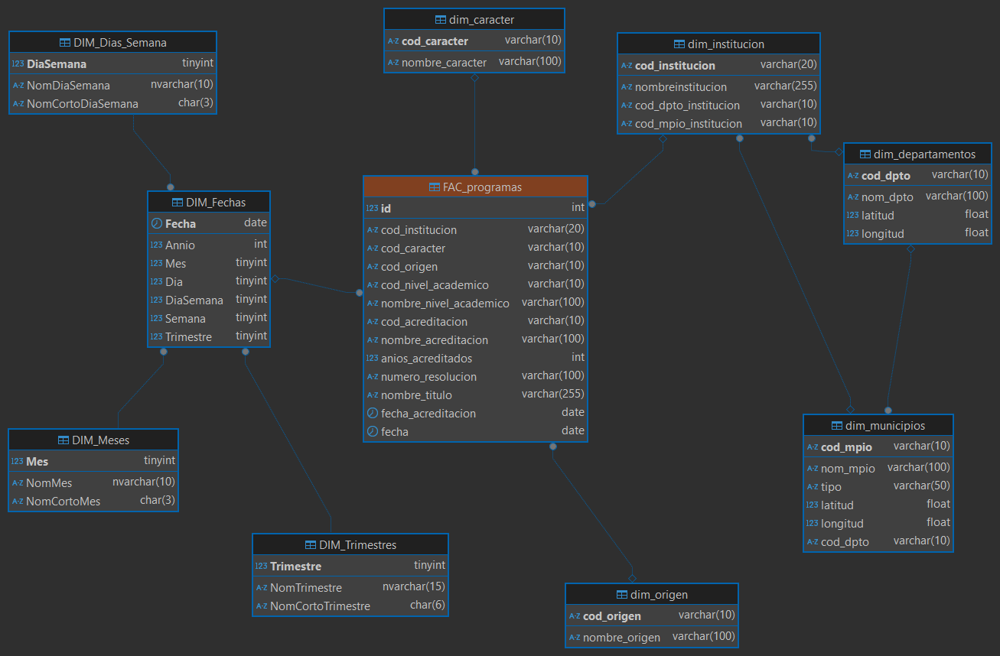

# Data Warehouse

Diseño de un almacen central de datos con modelado de dimensiones y hechos para el análisis de los programas de educación superior en Colombia.

**1. Scripts:**  Contiene el código SQL de las tablas que almacenarán los datos extraídos, transformados y cargados desde el Data Lake.

**2. ETL:**  Contiene los procesos de Extracción, Transformación y Carga de los datos contenidos en el Data Lake para ser cargados en el Data Warehouse.

**3. Modelo ER:**  Modelo Entidad Relación de Copo de Nieve del Data Warehouse.

