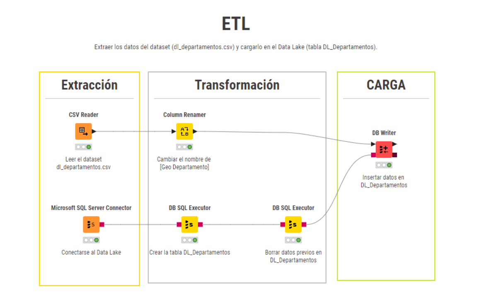

# ETL
_________________________________________________________________________________________________________________________________________________________________
Extraer los datos del dataset (dl_departamentos.csv) y cargarlo en el Data Lake (tabla DL_Departamentos).

Consideraciones:
Se puede ejecutar en cualquier orden dado que no tiene dependencias.
No es necesaria la preexistencia de la tabla, el proceso es capaz de crearla durante la ejecución.
Verificar la carpeta y la ruta del archivo CSV antes de la ejecución del ETL.
Verificar la conexión a la(s) base(s) de dato(s) antes de la ejecución del ETL.
