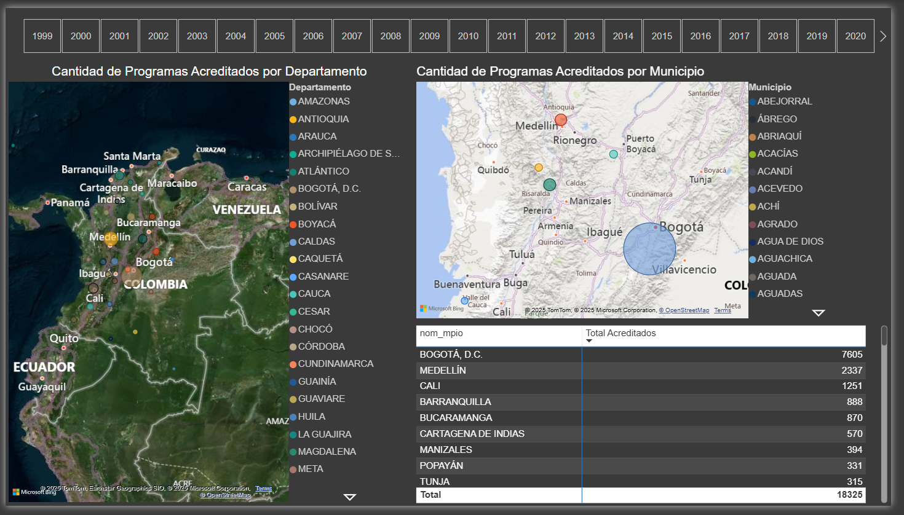
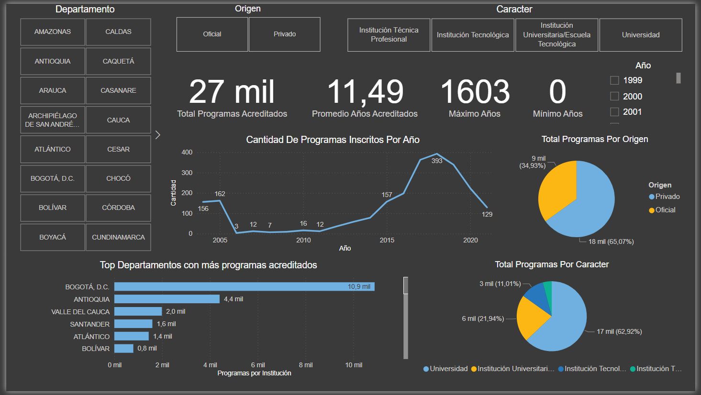
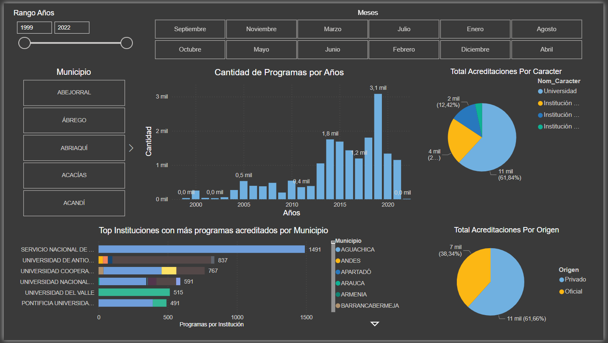

# Power BI

Diseño de un Dashboard utilizando Power BI para el análisis de los programas de educación superior en Colombia.

**Georreferenciación:** Permite la navegación en un mapa por años en los Departamentos y Municipios de Colombia.

**Tendencia:** Permite ver la tendencia de cantidad de programas inscritos por año en un gráfico de Línea. Se pueden aplicar filtros por origen y por caracter de los programas de educación superior.También muestra el Top los Departamentos con más programas acreditados.

**Años y Meses:** Permite ver el comportamiento por año de la cantidad de programas acreditados mediente un gráfico de barras. Se pueden aplicar filtros por Rango de Años, por Meses, por caracter, por origen. También muestra el Top de instituciones con más programas acreditados por municipios.

